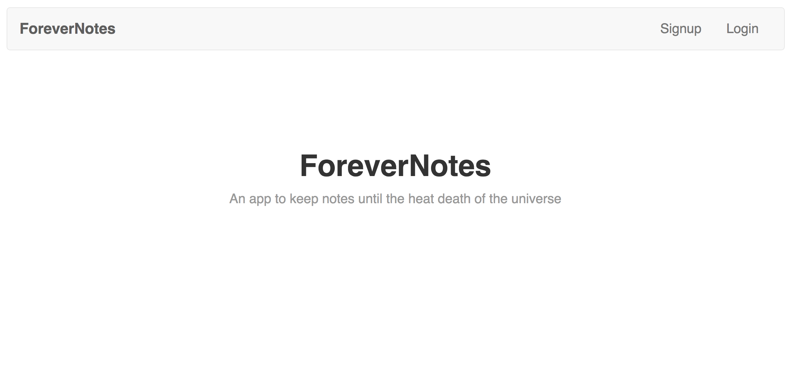
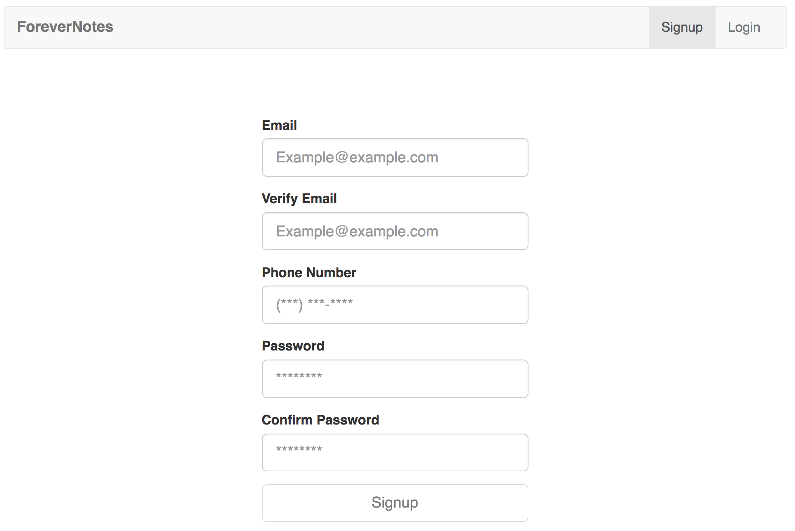
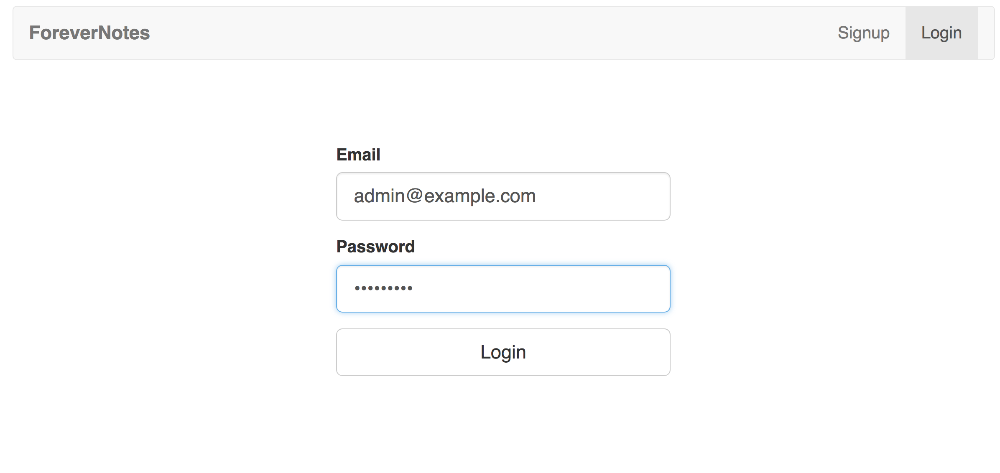
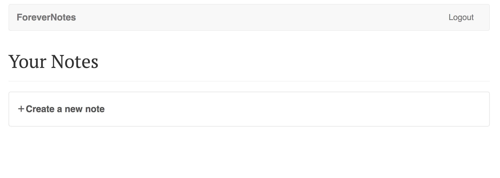
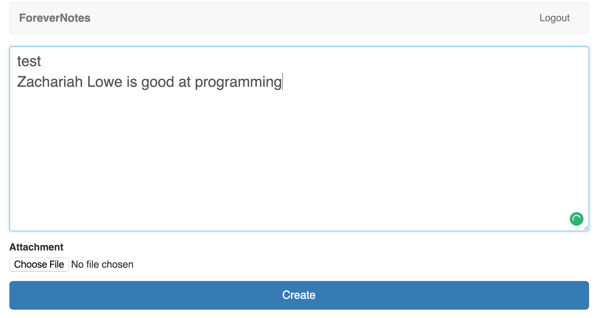
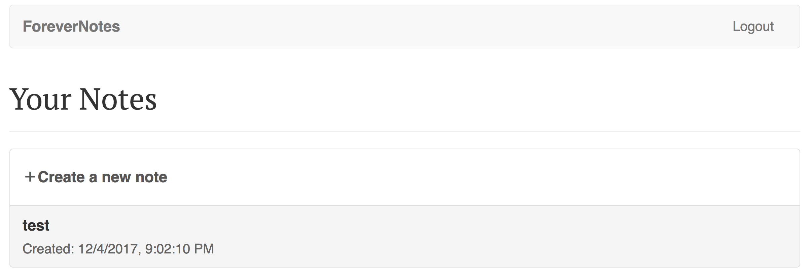
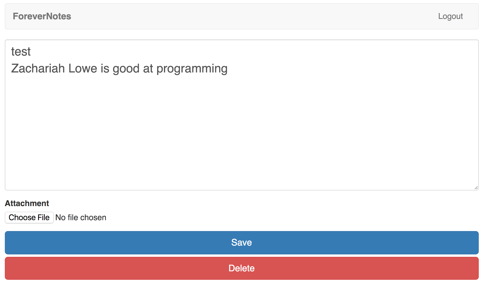
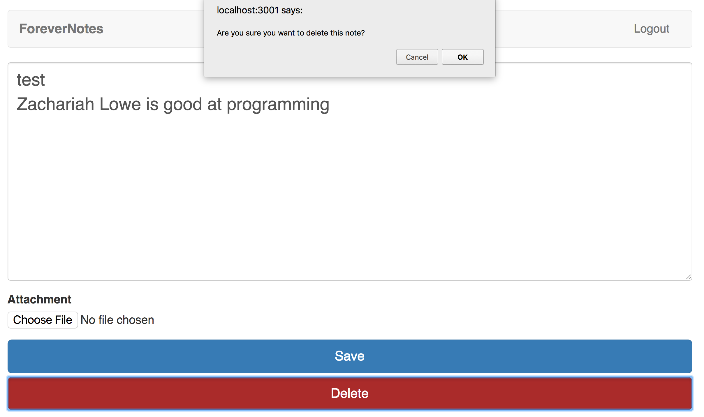
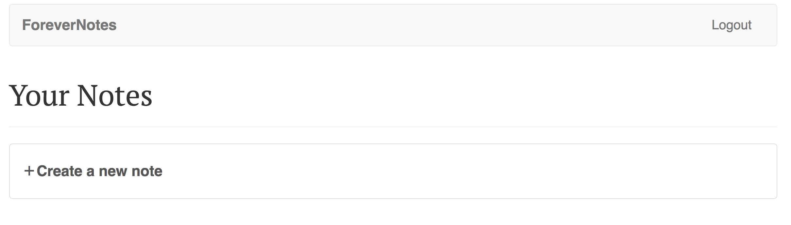

# ForeverNotes
* Note Taking App with a twist - the MySQL on AWS is set to stream across 3 continents, so not even a nuke could get rid of what you put in here. Encrypted by SHA256, this will last ~1 billion years, or for the current entirety of Google's computing resources, about 104 years.

## Tech: 
    Amazon Web Services: 
         Computing - EC2, Lambda
         Database - S3, DynamoDB
         API- API Gateway, CloudFront
         Authentication - Cognito User Pool, Cognito Federated Identities, IAM, GuardDuty
         Interface for AWS services management: AWS CLI
    Framework:
         Front-End FW - React.js
         Design - React-Strap Node package, Bootstrap

* CRUD compatible 
1. create = /post
1. read = /get
1. update = /put
1. delete = /delete

## example of use

## Splash page

<kbd></kbd>

## SignUp Page

<kbd></kbd>

## Login page

<kbd></kbd>

## Authenticated Splash page

<kbd></kbd>

## New Note page

<kbd></kbd>

## Updated, Authenticated Splash page

<kbd></kbd>

## View Note page

<kbd></kbd>

## Delete Note Alert

<kbd></kbd>

## Re-Updated, Authenticated Splash page

<kbd></kbd>
           -   -
	  -  -  -
	   -   -
	    - -
	     -
